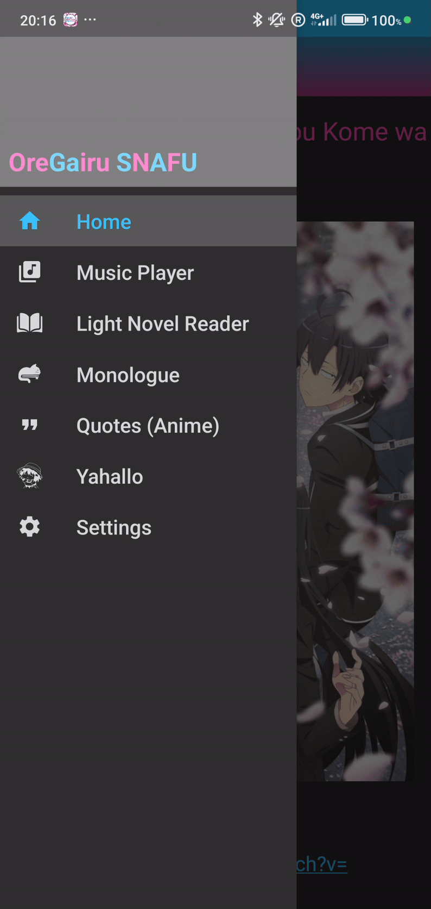

# OreSnafu

[**OreSnafu**](https://github.com/PyroWilDx/OreSnafu/) is a versatile Android app based on [OreGairu](https://anilist.co/manga/70171/Yahari-Ore-no-Seishun-Love-Come-wa-Machigatteiru/). The app features a music player, a book reader, and a clicker game inspired by [Tuturu](https://play.google.com/store/apps/details?id=com.VizegrafIndie.Tuturu).

 

## Download

|  |
|---|

## Development Set-Up

|  |  |  |
|---|---|---|

### How To Use

- Run w/ Android Studio.

---

  Copyright &#169; 2019 PyroWilDx. All Rights Reserved.

